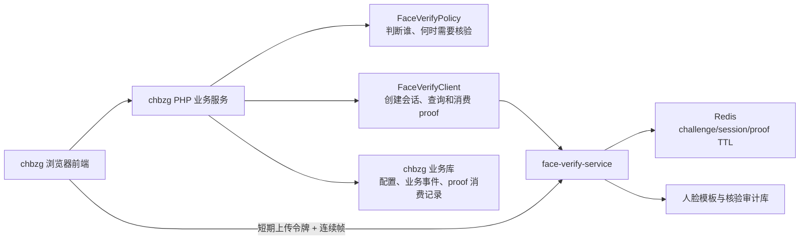

# chbzg 人脸核验继承集成方案与任务拆分

## 1. 文档结论

本次集成不在 `chbzg` 现有人脸核验代码上继续优化识别效果，而是采用以下边界：

```text
chbzg 是业务规则权威：
- 决定谁需要扫脸
- 决定什么场景、什么时间需要扫脸
- 确定当前必须核验的医生或药师
- 在业务接口中决定是否允许登录、审核通过、审核驳回

face-verify-service 是人脸判定权威：
- 管理新版基准人脸模板
- 生成随机活体动作
- 校验连续帧、动作、重复帧、单人脸和人脸稳定性
- 执行 PAD 防翻拍和多帧 1:1 人脸比对
- 签发绑定人员、场景和业务事件的一次性核验凭证
```

线上现有单动作前端活体、单张图片比对、旧 `feature` 以及旧远程人脸接口均不得参与最终通过判定。旧链路仅在影子验证和紧急回滚期临时保留。

本方案的核心不是“把 Demo 页面嵌入线上”，而是：

1. 将本地 `face-verify-demo` 生产化为独立人脸核验服务。
2. 将 `chbzg` 现有“指定谁扫脸、何时扫脸”的业务规则接入该服务。
3. 在登录和审核的服务端最终写入口强制消费一次性核验凭证，杜绝绕过前端直接调用业务接口。

## 2. 两侧审计结论

### 2.1 本地 face-verify-demo

本地项目已具备可继承的核心检测能力：

- InsightFace 提取基准人脸向量并执行多帧 1:1 比对。
- 随机生成 1-3 个动作，每个动作采集约 2 秒。
- 服务端使用 MediaPipe 判断动作，不信任前端动作结果。
- 校验帧数量、动作顺序、采集时长、帧间隔和重复帧。
- 抽样检查单人脸、多帧人脸稳定性和人脸一致性。
- 使用双 MiniFASNet 模型进行 PAD 防翻拍检测。
- challenge 与 `enrollment_id` 绑定，有 TTL 且只能验证一次。
- 阈值由服务端固定，客户端不能修改。
- 前端使用 360px、约 11 帧/动作，重模型只抽样少量帧，适合低配终端。

当前综合通过条件为：

```text
challenge 有效且未使用
AND challenge 与基准模板绑定一致
AND 帧协议和动作顺序正确
AND 每个动作均通过
AND 重复帧检查通过
AND 抽样帧单人脸且人脸稳定
AND PAD 防翻拍通过
AND 多帧人脸与基准模板匹配
```

但它当前仍是 Demo，不能直接上线：

- 模板和 challenge 使用进程内 `MemoryStore`，服务重启即丢失。
- 没有人员、场景、业务事件绑定。
- 没有可供业务系统消费的一次性 proof。
- CORS 为 `*`，接口无服务鉴权。
- 没有模板版本、吊销、更新和迁移状态。
- 没有并发控制、就绪检查、生产审计和多实例一致性。
- 当前 InsightFace `buffalo_l` 模型权重存在商用许可风险，上线前必须确认或替换。
- 当前 `/api/compare` 是重复步骤，生产流程应收敛为一次综合核验结果。

### 2.2 线上 chbzg

截至 2026-06-12，线上数据库实际配置为：

```text
face_verify_doctor=1
face_verify_doctor_ids=83,96,84
face_verify_pharmacist=0
face_verify_pharmacist_ids=
```

当前真实业务规则：

- 医生组为 `group_id=4`，药师组为 `group_id=14`。
- 登录时由用户名映射到 `admin`，再映射到医生或药师 ID。
- 医生审核在 09:00-20:00 的四个时间窗内随机触发，每窗完成一次后不再触发。
- 药师审核当前关闭人脸核验；开启后通过和驳回都需要核验。
- 医生审核通过后仍需执行现有签名和业务状态更新。
- 药师仍需维持现有 `pass/reject` 和状态推进逻辑。

当前线上最大问题不是阈值，而是业务接口可绕过：

- 登录只由前端 JS 在提交前弹出核验，真正的登录接口没有强制校验 proof。
- 医生审核只由前端 JS 决定何时弹出核验，后端审核写入口没有强制校验 proof。
- 药师 `pass/reject` 后端接口没有强制校验 proof。
- 现有人脸比较接口存在只要响应包含 `match` 或 `similarity` 字段就可能判成功的问题。
- 当前服务端仅接收一张图片，无法证明浏览器真正完成了活体动作。
- 多个人脸接口和日志接口处于无需登录/权限的暴露状态。
- 药师旧流程会将抓拍图片写入公开上传目录。

## 3. 必须保留的线上业务逻辑

### 3.1 指定人员配置

继续使用 `fa_config` 中现有四个配置项，不改变业务语义：

| 开关 | ID 列表 | 执行结果 |
| --- | --- | --- |
| 关闭 | 任意 | 该角色全部跳过人脸核验 |
| 开启 | 空 | 该角色全部需要人脸核验 |
| 开启 | 非空 | 仅名单中的人员需要核验 |

`chbzg` 必须在服务端根据当前登录用户或待登录用户名解析真实人员 ID。浏览器不得直接指定要核验的 `doctorId` 或 `pharmacistId`。

### 3.2 医生登录

保留“命中指定医生时登录前核验”的业务要求，但改成服务端强制流程：

```text
提交账号密码
→ chbzg 验证凭据但暂不建立正式登录态
→ chbzg 服务端判断是否需要人脸核验
→ 不需要：正常建立登录态
→ 需要：创建绑定 adminId、doctorId、login 场景的 pre-login 业务事件
→ 完成人脸核验并获得 proof
→ 再提交 proof
→ chbzg 服务端校验并消费 proof
→ 建立正式登录态
```

登录 proof 必须绑定：

- `subject_type=doctor/pharmacist`
- `subject_id`
- `admin_id`
- `scene=login`
- 服务端生成的 `business_event_id`
- 有效期

### 3.3 医生审核

保留当前四个时间窗和随机触发规则：

- 09:00-11:00
- 11:00-13:00
- 13:00-17:00
- 17:00-20:00

但必须调整触发与放行职责：

- 前端查询 `checkFaceVerifyTrigger` 只用于展示，不作为最终放行依据。
- 医生审核后端写入口必须重新判断本次业务是否要求核验。
- 要求核验时，必须消费绑定当前医生、当前记录、当前审核动作和当前时间窗的 proof。
- 只有 proof 消费成功并完成业务操作，才写入“该时间窗已核验”的成功记录。
- 客户端提交的普通日志不能用于判断本时间窗已经完成核验。

### 3.4 药师审核

当前保持关闭，不影响药师审核业务。

后续开启时：

- 继续由 `face_verify_pharmacist` 和 `face_verify_pharmacist_ids` 决定谁需要核验。
- `pass` 与 `reject` 后端写入口都必须校验 proof。
- 不再保存公开的临时人脸图片。

## 4. 统一目标架构



推荐浏览器将连续帧直接上传给人脸服务，避免大量 Base64 帧经过 PHP。浏览器只能使用 `chbzg` 服务端签发的短期上传令牌，不能自行创建任意人员的核验会话。

## 5. 核心安全模型

### 5.1 三个权威对象

生产流程必须围绕三个对象设计：

1. `face_template`：某个人员的某个版本基准人脸向量。
2. `verification_session`：一次活体与本人核验过程。
3. `verification_proof`：一次核验成功后签发、只能用于一个业务事件的凭证。

三者必须形成不可替换绑定：

```text
subject
→ active template version
→ verification session
→ business event
→ single-use proof
→ final business operation
```

### 5.2 proof 必须绑定的字段

```text
proof_id
session_id
subject_type
subject_id
admin_id（登录场景）
scene（login / doctor_audit / pharmacist_pass / pharmacist_reject）
business_event_id
record_id（审核场景）
action（pass / reject / audit）
policy_version
template_id
template_version
model_version
threshold_version
issued_at
expires_at
consumed_at
result=PASS
```

任何字段不一致均不得放行。proof 不能跨人员、跨业务记录、跨登录/审核场景复用。

### 5.3 proof 原子消费

仅调用远程 `/consume` 后再执行业务更新，会出现“proof 已消费但业务失败”的跨系统一致性问题。推荐方式：

1. 人脸服务签发不可伪造、可在线查询的 `proof_id`。
2. `chbzg` 在最终业务接口调用人脸服务校验 proof 状态。
3. `chbzg` 在自身业务数据库事务中：
   - 写入带唯一索引的 proof 消费记录；
   - 执行登录前置状态或审核业务更新；
   - 写入核验成功业务日志。
4. 重复提交相同 `proof_id` 时，由唯一索引拒绝。
5. 业务事务失败时，本地 proof 消费记录也回滚；proof 可在有效期内重试同一个 `business_event_id`。
6. 业务事务成功后，异步通知人脸服务将 proof 标记为已消费。

这保证 proof 不能复用，同时避免网络或业务异常导致用户无意义地重新扫脸。

### 5.4 失败关闭策略

| 场景 | 策略 |
| --- | --- |
| 人员不需要扫脸 | 正常放行 |
| 人员需要扫脸且模板有效 | 必须完成核验 |
| 人员需要扫脸但没有有效模板 | 阻断并提示重新登记，不得自动跳过 |
| 人脸服务返回明确核验失败 | 阻断 |
| 人脸服务超时、模型不可用、网络异常 | 阻断当前高风险操作，允许用户重新发起 |
| challenge 因服务端 5xx 失败 | 允许受控重试，不应按用户失败消费 |
| proof 已使用、过期或字段不匹配 | 阻断并重新核验 |

不允许在人脸服务异常时静默放行指定人员。

## 6. 新版模板与旧数据迁移

### 6.1 不能直接复用旧 feature

线上旧 `fa_doctor.feature` / `fa_pharmacist.feature` 与本地 InsightFace 向量的模型、维度、预处理方式和版本未证明一致。旧样本约为 1032 bytes，不能直接作为新版模板使用。

药师 `template` 是指纹模板，与人脸向量无关，必须保持隔离，不能转换或覆盖。

### 6.2 模板迁移来源

迁移优先使用线上现有 `avatar` 原图：

```text
读取需核验人员 avatar
→ 校验 URL、文件类型、大小和哈希
→ 新人脸服务检测是否存在且仅存在一张清晰人脸
→ 提取新版向量
→ 保存模板版本和来源哈希
→ 绑定 subject_type + subject_id
```

迁移失败的人员进入 `pending_reenroll`，由管理员重新采集清晰正脸。迁移失败不得自动回退到旧向量并当作新向量使用。

### 6.3 推荐模板表

建议人脸服务维护模板主表，`chbzg` 保留业务映射和状态镜像。

```text
face_templates
- template_id
- subject_type
- subject_id
- embedding_blob（加密存储）
- embedding_dimension
- model_name
- model_version
- license_tag
- source_image_hash
- source_type（avatar / manual_enroll）
- quality_score
- status（pending / active / revoked / invalid）
- created_at
- activated_at
- revoked_at
```

约束：

- 每个 subject 同一时间只能有一个 active 模板。
- 更新头像不应立刻覆盖现有模板；新模板验证成功后再原子切换。
- 模板必须记录模型和向量版本，模型升级时进行双版本迁移。
- 原始头像和活体帧默认不长期存储。

## 7. 推荐生产 API

### 7.1 服务间接口

所有服务间接口仅允许 `chbzg` 后端调用，使用 HTTPS、服务签名、时间戳和请求 ID。

#### 登记或更新模板

```http
POST /v1/internal/templates
```

输入人员身份和基准图片，返回 `template_id`、版本、质量结果和状态。

#### 创建核验会话

```http
POST /v1/internal/verification-sessions
```

请求示例：

```json
{
  "request_id": "幂等请求ID",
  "subject_type": "doctor",
  "subject_id": 83,
  "admin_id": 2112,
  "scene": "doctor_audit",
  "business_event_id": "服务端生成事件ID",
  "record_id": "处方或审核记录ID",
  "action": "audit"
}
```

返回：

```json
{
  "session_id": "...",
  "upload_token": "...",
  "actions": ["blink", "shake_head"],
  "labels": {},
  "expires_at": "..."
}
```

#### 查询 proof

```http
POST /v1/internal/proofs/introspect
```

由 `chbzg` 最终业务接口调用，返回 proof 是否有效及全部绑定字段。

#### 标记 proof 已消费

```http
POST /v1/internal/proofs/{proof_id}/finalize
```

使用幂等 `business_event_id`，由 `chbzg` 业务事务成功后异步调用。

### 7.2 浏览器采集接口

```http
POST /v1/verification-sessions/{session_id}/verify
Authorization: Bearer <短期 upload_token>
```

浏览器提交动作帧，但不能提交或修改：

- 人员 ID
- 模板 ID
- 业务场景
- 业务事件 ID
- 判定阈值
- 期望动作列表

核验成功后返回仅供提交给 `chbzg` 的 `proof_id`，普通页面不展示内部阈值和详细模型分数。

### 7.3 统一结果码

```text
PASS
FAIL_ACTION
FAIL_PROTOCOL
FAIL_DUPLICATE_FRAMES
FAIL_MULTI_FACE
FAIL_FACE_QUALITY
FAIL_FACE_INCONSISTENT
FAIL_PAD
FAIL_FACE_MISMATCH
FAIL_TEMPLATE_MISSING
FAIL_TEMPLATE_INVALID
EXPIRED_SESSION
USED_SESSION
ERROR_MODEL_UNAVAILABLE
ERROR_SERVICE_BUSY
```

## 8. 推荐数据结构

### 8.1 人脸服务

```text
verification_sessions
- session_id
- request_id
- subject_type
- subject_id
- template_id
- scene
- business_event_id
- record_id
- action
- expected_actions
- policy_version
- status（issued / verifying / passed / failed / expired）
- result_code
- similarity
- anti_spoof_score
- action_summary
- issued_at
- expires_at
- verified_at

verification_attempts
- attempt_id
- session_id
- request_id
- frame_count
- unique_ratio
- face_frame_ratio
- action_summary
- pad_summary
- similarity_summary
- result_code
- model_versions
- latency_ms
- created_at

verification_proofs
- proof_id
- session_id
- business_event_id
- subject_type
- subject_id
- scene
- record_id
- action
- status（ready / finalized / expired）
- issued_at
- expires_at
- finalized_at
```

### 8.2 chbzg

建议新增统一业务事件和 proof 消费表，不复用可由客户端伪造的普通日志。

```text
fa_face_verify_event
- id
- business_event_id（唯一）
- subject_type
- subject_id
- admin_id
- scene
- record_id
- action
- policy_snapshot
- required
- status（created / verifying / verified / consumed / failed / expired）
- proof_id（唯一）
- result_code
- created_at
- verified_at
- consumed_at

fa_face_profile
- subject_type
- subject_id
- active_template_id
- template_version
- avatar_hash
- status（pending / active / pending_reenroll / revoked）
- updated_at
```

## 9. chbzg 改造边界

### 9.1 新增统一组件

建议新增：

```text
FaceVerifyPolicy
- 根据角色、人员 ID、配置、场景、时间窗决定是否需要核验

FaceVerifyEventService
- 创建并持久化业务事件
- 将事件绑定登录或审核动作

FaceVerifyClient
- 调用人脸服务创建 session、查询 proof、finalize proof
- 统一处理签名、超时、重试和结果码

FaceVerifyGuard
- 在最终业务写入口校验 proof
- 在 chbzg 本地事务内原子消费 proof
```

### 9.2 必须修改的最终放行点

- `Index::login()`：需要扫脸时，没有有效登录 proof 不得创建登录态。
- 医生审核实际写入口：需要扫脸时，没有绑定当前医生和当前记录的 proof 不得更新审核状态。
- `Record::pass()` / `Record::reject()`：药师核验开启后，没有正确 proof 不得推进业务状态。

只修改前端弹窗或 `checkFaceVerifyTrigger` 不算完成集成。

### 9.3 前端职责

前端仅负责：

- 展示动作提示。
- 打开摄像头。
- 按动作采集连续帧。
- 使用短期令牌提交帧。
- 将 `proof_id` 随最终业务操作提交。
- 展示可理解的失败原因。

前端不得决定：

- 当前人员是否需要扫脸。
- 当前核验对象是谁。
- 动作是否完成。
- PAD 或人脸比对是否通过。
- proof 是否可用于当前业务。

## 10. 本地 face-verify-demo 生产化改造

### P0：上线阻塞项

- 将 `MemoryStore` 替换为 Redis + 持久化模板存储。
- 增加 subject、scene、business_event、record、action 绑定。
- 增加 verification session 状态机和一次性 proof。
- 增加服务间鉴权、短期上传令牌和严格 CORS。
- 将 `/verify` 收敛为最终综合判定，停止业务依赖 `/api/compare`。
- 增加模板登记、更新、吊销和版本管理。
- 增加统一机器结果码。
- 增加模型预加载和 `/ready` 检查，模型缺失时不得接流量。
- 确认或替换可商用的人脸模型和 PAD 模型。
- 使用真实样本完成阈值校准。

### P1：稳定性与运营项

- 区分用户失败和系统失败；模型 5xx 不应当作用户失败永久消费 challenge。
- 增加并发上限、排队、超时、限流和幂等请求 ID。
- 增加结构化审计日志和延迟指标。
- 增加模板迁移工具、失败清单和重采入口。
- 增加阈值版本、模型版本和策略版本。
- 默认不保存原始活体帧；调试帧使用短 TTL 且有访问审计。

### P2：后续增强项

- 虚拟摄像头与视频注入风险识别。
- 设备指纹和异常设备风控。
- 更强 PAD 模型和专用攻击样本评估。
- 多机房、容灾和异地故障切换。

## 11. 灰度、切换与回滚

### 11.1 灰度原则

继续使用当前医生名单 `83,96,84` 作为第一批灰度人员，不直接扩大范围。

### 11.2 分阶段切换

#### 阶段 A：模板迁移与影子验证

- 从现有头像生成新版模板。
- 迁移失败人员进入重采列表。
- 新服务只记录结果，不参与业务放行。
- 对比新旧结果、耗时和失败原因。

验收：

- 三名灰度医生均有有效新版模板。
- 新服务结果可追溯到模板、模型和阈值版本。
- 影子调用不影响现有登录和审核。

#### 阶段 B：医生登录强制切换

- 新人脸服务成为医生登录唯一核验来源。
- `Index::login()` 服务端强制校验 proof。
- 旧前端活体和旧单图比对不再参与放行。

验收：

- 正常浏览器流程可登录。
- 禁用 JS、抓包、直接调用登录接口均无法绕过。
- proof 跨人员、跨场景、过期、重复使用均失败。

#### 阶段 C：医生审核强制切换

- 保留现有时间窗触发规则。
- 审核后端写入口强制校验 proof。

验收：

- 时间窗触发逻辑不变。
- proof 必须绑定当前医生、记录和审核动作。
- 业务更新失败后可在同一事件有效期内安全重试。
- 同一 proof 不能用于第二笔审核。

#### 阶段 D：药师兼容接入

- 保持药师总开关关闭。
- 完成模板、前端和后端 Guard 接入。
- 使用少量指定 ID 灰度后再决定是否开启。

#### 阶段 E：清理旧链路

- 停止调用 `face.chbzg.com.cn:8091` 旧接口。
- 停止更新旧人脸 `feature`。
- 删除药师公开临时抓拍落盘。
- 收紧旧人脸接口的 `noNeedLogin/noNeedRight`。
- 旧表和旧接口先只读保留一个回滚周期，再下线。

### 11.3 回滚规则

回滚必须是显式、可审计的发布动作，不允许运行时遇到新人脸服务异常就自动放行。

推荐回滚级别：

1. 回滚前端采集版本，但仍要求 proof。
2. 回滚人脸服务版本和模型版本。
3. 回滚到旧链路仅限紧急发布，并记录操作人、原因、开始和结束时间。
4. 回滚期间仍不得因服务异常无条件跳过指定人员核验。

## 12. 完整任务拆分

### 工作流 A：人脸服务生产化

| 编号 | 任务 | 优先级 | 验收 |
| --- | --- | --- | --- |
| A1 | 设计模板、session、attempt、proof 状态模型 | P0 | 状态和转换有测试 |
| A2 | Redis challenge/session/proof 存储与 TTL | P0 | 重启和多实例下状态一致 |
| A3 | 持久化模板存储、加密、版本、吊销 | P0 | 模板可更新且旧模板不可误用 |
| A4 | 增加业务绑定和短期上传令牌 | P0 | 浏览器不能篡改 subject/scene/event |
| A5 | 收敛 `/verify` 最终判定和统一结果码 | P0 | 业务不再依赖 `/compare` |
| A6 | 服务鉴权、CORS、限流、请求大小限制 | P0 | 未授权请求被拒绝 |
| A7 | 模型许可确认、预置、预热、ready 检查 | P0 | 启动不联网，ready 后才接流量 |
| A8 | 并发、幂等、超时和系统错误重试 | P1 | 5xx 不错误消耗用户机会 |
| A9 | 结构化日志、指标、阈值和模型版本 | P1 | 每次结果可追溯 |

### 工作流 B：chbzg 业务集成

| 编号 | 任务 | 优先级 | 验收 |
| --- | --- | --- | --- |
| B1 | 抽取 `FaceVerifyPolicy`，保留现有四项配置语义 | P0 | 指定人员行为与当前一致 |
| B2 | 新增事件表、profile 映射表、proof 唯一消费约束 | P0 | proof 无法重复消费 |
| B3 | 实现 `FaceVerifyClient/EventService/Guard` | P0 | 服务调用和失败策略统一 |
| B4 | 登录流程增加 pre-login 事件和服务端 proof Guard | P0 | 直连登录不能绕过 |
| B5 | 医生审核最终写入口增加 proof Guard | P0 | 禁用 JS 不能绕过 |
| B6 | 药师 pass/reject 最终写入口增加 proof Guard | P0 | 开启后无 proof 必失败 |
| B7 | 替换前端单图活体为连续帧采集 | P0 | 动作结果以后端为准 |
| B8 | 停止公开临时图片落盘和旧宽松响应判断 | P0 | 无公开活体图片残留 |
| B9 | 收紧旧人脸接口权限并下线旧依赖 | P1 | 旧接口不能成为旁路 |

### 工作流 C：模板迁移

| 编号 | 任务 | 优先级 | 验收 |
| --- | --- | --- | --- |
| C1 | 导出需核验人员和头像映射 | P0 | 人员、角色、头像一一对应 |
| C2 | 批量生成新版模板并记录来源哈希 | P0 | 成功、失败、重复均可追踪 |
| C3 | 处理无脸、多脸、模糊、无效头像 | P0 | 失败人员进入重采列表 |
| C4 | 管理员重新登记入口 | P1 | 可完成重采和模板切换 |
| C5 | 模型升级双版本迁移机制 | P2 | 可平滑升级模型 |

### 工作流 D：测试与验收

| 编号 | 任务 | 优先级 | 验收 |
| --- | --- | --- | --- |
| D1 | API 契约、状态机、TTL、幂等、proof 绑定测试 | P0 | 自动化通过 |
| D2 | 登录与审核防绕过测试 | P0 | 禁 JS、直连接口、重放均失败 |
| D3 | 本人、非本人、照片、屏幕、视频样本测试 | P0 | 达到现场验收指标 |
| D4 | 低配终端和网络波动测试 | P0 | 页面不卡死，失败可重试 |
| D5 | 并发、超时、重启、多实例一致性测试 | P1 | 状态不丢失、不串换 |
| D6 | 灰度、回滚和旧链路下线演练 | P1 | 可在明确发布步骤内回滚 |

## 13. 验收标准

### 13.1 业务规则

- 配置关闭、全员开启、指定 ID 三种模式与当前语义一致。
- 当前医生 `83,96,84` 作为首批灰度人员。
- 药师关闭时不影响现有业务。
- 医生审核时间窗触发规则保持一致。

### 13.2 防绕过

- 禁用前端 JavaScript 后不能绕过登录或审核核验。
- 直接调用业务接口不能绕过。
- proof 跨人员、跨场景、跨记录、跨动作使用全部失败。
- proof 过期和重复使用失败。
- 客户端篡改阈值、模板 ID、人员 ID 和动作列表失败。

### 13.3 人脸效果

- 本人普通环境 5 次至少 4 次通过。
- 非本人全部失败。
- 静态照片和屏幕照片全部失败。
- 普通视频回放原则上失败，若有通过必须留样本调优。
- 多脸、重复帧和乱序帧全部失败。
- 动作、PAD 和人脸匹配任何一层失败均不得签发 proof。

### 13.4 性能与稳定性

- 前端继续使用约 360px、200ms 间隔、每动作 2 秒的低配策略。
- 页面采集期间保持可操作，不明显卡死。
- 模型启动不依赖外网下载。
- 服务重启或多实例切换不丢失有效模板和会话。
- 系统错误与用户核验失败可区分。

## 14. 文件与证据位置

本地项目关键证据：

- `backend/app/main.py`：enroll、challenge、verify、综合通过条件、帧协议和多帧比对。
- `backend/app/stores.py`：当前进程内 `MemoryStore`。
- `backend/app/liveness.py`：服务端动作判断。
- `backend/app/anti_spoofing.py`：PAD 抽样和通过规则。
- `backend/app/config.py`：服务端阈值和 1-3 动作配置。
- `backend/static/app.js`：低配连续帧采集策略。
- `tests/test_verification_guards.py`：阈值、挑战绑定、失败消费和非本人拒绝测试。

线上项目关键证据：

- `/www/wwwroot/chbzg/application/admin/model/Config.php`：指定人员核验配置规则。
- `/www/wwwroot/chbzg/application/admin/controller/Index.php`：登录触发与旧单图比较。
- `/www/wwwroot/chbzg/application/admin/controller/Doctor.php`：医生比较、日志和审核时间窗。
- `/www/wwwroot/chbzg/application/admin/controller/Record.php`：医生/药师审核最终业务写入口和药师旧比较。
- `/www/wwwroot/chbzg/public/assets/js/backend/index.js`：当前登录前端触发。
- `/www/wwwroot/chbzg/public/assets/js/backend/record.js`：当前医生和药师审核前端触发。
- `/www/wwwroot/chbzg/public/assets/js/backend/liveness_detect.js`：当前单动作、前端判断、单图上传流程。

## 15. 最终实施原则

1. 识别效果完全以本地项目生产化后的综合判定为准。
2. “谁需要扫脸、何时扫脸、扫完允许做什么”完全以 `chbzg` 服务端业务规则为准。
3. 任何需要扫脸的业务操作，最终后端写入口都必须消费绑定正确的一次性 proof。
4. 旧向量不得直接作为新向量使用；必须从有效头像或人工重采生成新版模板。
5. 人脸服务异常、模板缺失和 proof 异常不得静默放行。
6. 先完成 P0、防绕过和三名医生灰度，再扩大人员范围。

